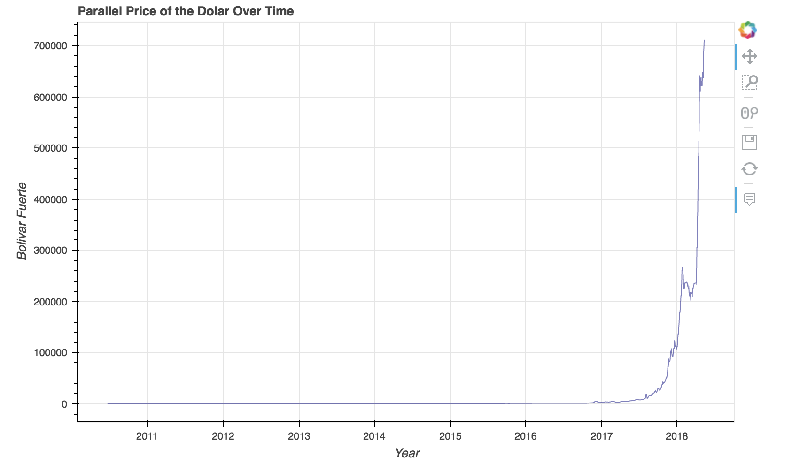
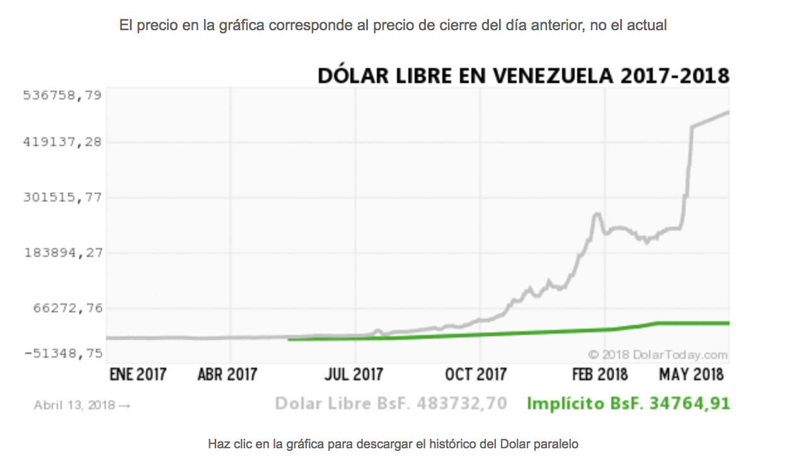

# Visualizing the Dollar (English Version)

Using Bokeh to create an interactive view of the "parallel" dollar price

<a href="http://htmlpreview.github.io/?https://github.com/anaparravera/visualizing-the-dollar/images/parallel-dollar-image.html">
   
</a>

## Background
In Venezuela we have currency control. People living abroad cannot simply send money to their relatives at home, and vice-versa. Because of this, the black market exists, where you can “sell” and “buy” dollars by transferring to a third party living abroad who in turn transfers Bolivares to the recipient’s account in Venezuela. The price of the dollar is in this market is called the “parallel price” and everyone always checks it on [dolartoday.com](https://dolartoday.com). Because of the hyperinflation and political situation Venezuela is facing, this price fluctuates drastically daily. People joke that you can never know “what the dollar will do tomorrow”.

More information about the black market can be found here: https://en.wikipedia.org/wiki/Venezuelan_bol%C3%ADvar#Currency_black_market


## Data Source
dolartoday.com updates the parallel dollar price on a daily basis: https://dolartoday.com/indicadores/
To download historical data on the parallel dollar, click on the image that is titled "DOLAR LIBRE EN VENEZUELA"


### How to Run This Notebook
Make sure you have Jupyter Notebook [installed](https://jupyter.readthedocs.io/en/latest/install.html#new-to-python-and-jupyter).

Then, from your terminal, you can type
```
jupyter notebook
```

More info [here](http://jupyter-notebook-beginner-guide.readthedocs.io/en/latest/execute.html).


# Visualizando El Dolar Paralelo (Spanish Version)

Vuelve pronto para ver la versión en Español.
